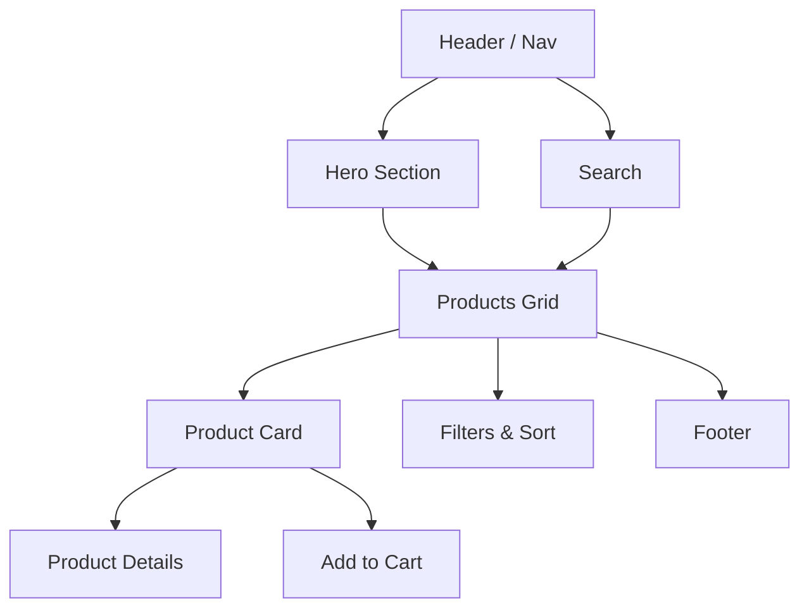

# solid_resposive

🎉 Welcome, brave code explorer! 🎉

This is a tiny, sassy demo of responsive design — it stretches, shrinks, and occasionally strikes a dramatic pose when the viewport changes.

Live demo
- Behold the responsiveness: https://genuinely-resposive.netlify.app/ 🌐 — open it, resize your window, and enjoy the show.

What is this?
- A responsive example of a products website — minimal, modular, and a little dramatic.
- Great for demos, tinkering, or convincing someone that CSS can be theatrical.

Quick start
1. Clone the repo:
   git clone https://github.com/khada217/solid_resposive.git
2. Open the files in your browser or visit the demo link above.
3. Resize the browser and witness graceful (or delightfully chaotic) layout changes.

Mermaid architecture diagram

The diagram below is a Mermaid.js flowchart that shows the high-level structure of the demo site. GitHub supports rendering Mermaid code blocks in Markdown; if your viewer does not render it, you can paste the block into the Mermaid Live Editor: https://mermaid.live/

Contributing (aka: help it grow up)
- Fork it
- Create a branch: git checkout -b my-awesome-thing
- Commit: git commit -am "Make it shinier ✨"
- Push: git push origin my-awesome-thing
- Open a PR and bask in mild adoration

Ideas & roadmap
- Add component examples with delightful names
- Add tests so it stops being afraid of CI
- Add badges and a LICENSE file (lawyers love those)

Known issues (probably)
- May not behave on ancient browsers or time machines
- Might require human feelings to debug

License
- Add a LICENSE file to pick the legal flavor.

Contact
- Maintainer: khada217 — issues, polite pull requests, or carrier pigeons welcome.

Thanks for stopping by! If this README made you smile, mission accomplished. If it made you snort coffee through your nose, here's a virtual cookie 🍪
